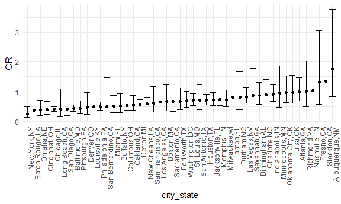
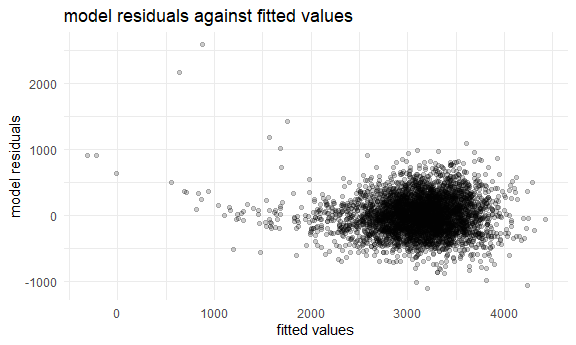
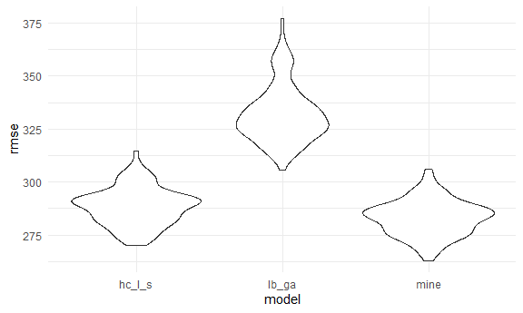

Homework 6 solutions
================
Yanhao Li

``` r
library(modelr)
library(mgcv)
```

    ## Loading required package: nlme

    ## 
    ## Attaching package: 'nlme'

    ## The following object is masked from 'package:dplyr':
    ## 
    ##     collapse

    ## This is mgcv 1.8-33. For overview type 'help("mgcv-package")'.

``` r
library(p8105.datasets)
```

### Problem 1

``` r
homicide_df = 
  read_csv("data/homicide-data.csv", na = c("", "NA", "Unknown")) %>% 
  mutate(
    city_state = str_c(city, state, sep = ","),
    victim_age = as.numeric(victim_age),
    resolution = case_when(
      disposition == "Closed without arrest" ~ 0,
      disposition == "Open/No arrest" ~ 0,
      disposition == "Closed by arrest" ~ 1
    )
  ) %>% 
  filter(
    victim_race %in% c("White", "Black"),
    city_state != "Tulsa,AL") %>% 
  select(city_state, resolution, victim_age, victim_race, victim_sex)
```

    ## 
    ## -- Column specification --------------------------------------------------------
    ## cols(
    ##   uid = col_character(),
    ##   reported_date = col_double(),
    ##   victim_last = col_character(),
    ##   victim_first = col_character(),
    ##   victim_race = col_character(),
    ##   victim_age = col_double(),
    ##   victim_sex = col_character(),
    ##   city = col_character(),
    ##   state = col_character(),
    ##   lat = col_double(),
    ##   lon = col_double(),
    ##   disposition = col_character()
    ## )

Start with one city.

``` r
baltimore_df =
  homicide_df %>% 
  filter(city_state == "Baltimore,MD")

glm(resolution ~ victim_age + victim_race + victim_sex, 
    data = baltimore_df,
    family = binomial()) %>% 
  broom::tidy() %>% 
  mutate(
    OR = exp(estimate),
    CI_lower = exp(estimate - 1.96 * std.error),
    CI_upper = exp(estimate + 1.96 * std.error)
  ) %>% 
  select(term, OR, starts_with("CI")) %>% 
  knitr::kable(digits = 3)
```

| term              |    OR | CI\_lower | CI\_upper |
| :---------------- | ----: | --------: | --------: |
| (Intercept)       | 1.363 |     0.975 |     1.907 |
| victim\_age       | 0.993 |     0.987 |     1.000 |
| victim\_raceWhite | 2.320 |     1.648 |     3.268 |
| victim\_sexMale   | 0.426 |     0.325 |     0.558 |

Try this across cities.

``` r
models_results_df = 
  homicide_df %>% 
  nest(data = -city_state) %>% 
  mutate(
    models = 
      map(.x = data, ~glm(resolution ~ victim_age + victim_race + victim_sex, data = .x, family = binomial())),
    results = map(models, broom::tidy)
  ) %>% 
  select(city_state, results) %>% 
  unnest(results) %>% 
  mutate(
    OR = exp(estimate),
    CI_lower = exp(estimate - 1.96 * std.error),
    CI_upper = exp(estimate + 1.96 * std.error)
  ) %>% 
  select(city_state, term, OR, starts_with("CI")) 
```

``` r
models_results_df %>% 
  filter(term == "victim_sexMale") %>% 
  mutate(city_state = fct_reorder(city_state, OR)) %>% 
  ggplot(aes(x = city_state, y = OR)) + 
  geom_point() + 
  geom_errorbar(aes(ymin = CI_lower, ymax = CI_upper)) + 
  theme(axis.text.x = element_text(angle = 90, hjust = 1))
```



## Problem 2

Load and clean the data for regression analysis

``` r
bw_df = 
  read_csv("./data/birthweight.csv") %>% 
  janitor::clean_names() %>% 
  drop_na() %>% 
  mutate(
    babysex = case_when(
      babysex == 1 ~ "male",
      babysex == 2 ~ "female"
    ),
    frace = case_when(
      frace == 1 ~ "white",
      frace == 2 ~ "black",
      frace == 3 ~ "asian",
      frace == 4 ~ "puerto rican",
      frace == 8 ~ "other",
      frace == 9 ~ "unknown"
    ),
    malform = case_when(
      malform == 0 ~ "absent",
      malform == 1 ~ "present"
    ),
    mrace = case_when(
      mrace == 1 ~ "white",
      mrace == 2 ~ "black",
      mrace == 3 ~ "asian",
      mrace == 4 ~ "puerto Rican",
      mrace == 8 ~ "other"
    ),
    babysex = factor(babysex),
    frace = factor(frace),
    malform = factor(malform),
    mrace = factor(mrace)
    )
```

    ## 
    ## -- Column specification --------------------------------------------------------
    ## cols(
    ##   .default = col_double()
    ## )
    ## i Use `spec()` for the full column specifications.

    ## Warning in FUN(X[[i]], ...): strings not representable in native encoding will
    ## be translated to UTF-8

    ## Warning in FUN(X[[i]], ...): unable to translate '<U+00C4>' to native encoding

    ## Warning in FUN(X[[i]], ...): unable to translate '<U+00D6>' to native encoding

    ## Warning in FUN(X[[i]], ...): unable to translate '<U+00E4>' to native encoding

    ## Warning in FUN(X[[i]], ...): unable to translate '<U+00F6>' to native encoding

    ## Warning in FUN(X[[i]], ...): unable to translate '<U+00DF>' to native encoding

    ## Warning in FUN(X[[i]], ...): unable to translate '<U+00C6>' to native encoding

    ## Warning in FUN(X[[i]], ...): unable to translate '<U+00E6>' to native encoding

    ## Warning in FUN(X[[i]], ...): unable to translate '<U+00D8>' to native encoding

    ## Warning in FUN(X[[i]], ...): unable to translate '<U+00F8>' to native encoding

    ## Warning in FUN(X[[i]], ...): unable to translate '<U+00C5>' to native encoding

    ## Warning in FUN(X[[i]], ...): unable to translate '<U+00E5>' to native encoding

Propose a regression model for birthweight

My hypothesized structure includes `babysex`, `bhead`, `blength`,
`gaweeks`, `smoken`, and `wtgain`. P-values of all factors mentioned
before are lower than 0.05. Consequently, I keep all factors.

``` r
fit = lm(bwt ~ babysex + bhead + blength + gaweeks + smoken + wtgain, data = bw_df)

broom::glance(fit)
```

    ## # A tibble: 1 x 12
    ##   r.squared adj.r.squared sigma statistic p.value    df  logLik    AIC    BIC
    ##       <dbl>         <dbl> <dbl>     <dbl>   <dbl> <dbl>   <dbl>  <dbl>  <dbl>
    ## 1     0.695         0.695  283.     1647.       0     6 -30670. 61356. 61407.
    ## # ... with 3 more variables: deviance <dbl>, df.residual <int>, nobs <int>

``` r
broom::tidy(fit) %>% 
  select(-std.error, -statistic) %>% 
  knitr::kable(digits = 3)
```

| term        |   estimate | p.value |
| :---------- | ---------: | ------: |
| (Intercept) | \-6101.068 |   0.000 |
| babysexmale |   \-32.686 |   0.000 |
| bhead       |    138.447 |   0.000 |
| blength     |     79.834 |   0.000 |
| gaweeks     |     13.493 |   0.000 |
| smoken      |    \-1.956 |   0.001 |
| wtgain      |      3.520 |   0.000 |

Show a plot of model residuals against fitted values

Generally, points are evenly distributed above and below the x-axis.
However, there are some outliers at top left corner.

``` r
bw_df %>% 
  add_residuals(fit) %>%
  add_predictions(fit) %>%
  ggplot(aes(x = pred, y = resid)) +
  geom_point(alpha = .2) +
  labs(
    x = "fitted values",
    y = "model residuals",
    title = "model residuals against fitted values"
  )
```



Compare your model to two others

Violin plot shows that my model has the lowest RMSE.

``` r
fit_lb_ga = lm(bwt ~ blength + gaweeks, data = bw_df)

fit_hc_l_s = lm(bwt ~ bhead * blength * babysex, data = bw_df)

broom::tidy(fit_lb_ga) %>% 
  select(-std.error, -statistic) %>% 
  knitr::kable(digits = 3)
```

| term        |   estimate | p.value |
| :---------- | ---------: | ------: |
| (Intercept) | \-4347.667 |       0 |
| blength     |    128.556 |       0 |
| gaweeks     |     27.047 |       0 |

``` r
broom::tidy(fit_hc_l_s) %>% 
  select(-std.error, -statistic) %>% 
  knitr::kable(digits = 3)
```

| term                      |   estimate | p.value |
| :------------------------ | ---------: | ------: |
| (Intercept)               |  \-801.949 |   0.467 |
| bhead                     |   \-16.598 |   0.626 |
| blength                   |   \-21.646 |   0.354 |
| babysexmale               | \-6374.868 |   0.000 |
| bhead:blength             |      3.324 |   0.000 |
| bhead:babysexmale         |    198.393 |   0.000 |
| blength:babysexmale       |    123.773 |   0.000 |
| bhead:blength:babysexmale |    \-3.878 |   0.000 |

``` r
crossv_mc(bw_df, 100) %>% 
  mutate(
    train = map(train, as_tibble),
    test = map(test, as_tibble)
  ) %>% 
  mutate(
    fit = map(.x = train, ~lm(bwt ~ babysex + bhead + blength + gaweeks + smoken + wtgain, data = .x)),
    fit_lb_ga = map(.x = train, ~lm(bwt ~ blength + gaweeks, data = .x)),
    fit_hc_l_s = map(.x = train, ~lm(bwt ~ bhead * blength * babysex, data = .x))
  ) %>% 
  mutate(
    rmse_mine = map2_dbl(.x = fit, .y = test, ~rmse(model = .x, data = .y)),
    rmse_lb_ga = map2_dbl(.x = fit_lb_ga, .y = test, ~rmse(model = .x, data = .y)),
    rmse_hc_l_s = map2_dbl(.x = fit_hc_l_s, .y = test, ~rmse(model = .x, data = .y))
  ) %>% 
  select(starts_with("rmse")) %>% 
  pivot_longer(
    everything(),
    names_to = "model",
    values_to = "rmse",
    names_prefix = "rmse_"
  ) %>% 
  ggplot(aes(x = model, y = rmse)) +
  geom_violin()
```



## Problem 3

Download data

``` r
weather_df = 
  rnoaa::meteo_pull_monitors(
    c("USW00094728"),
    var = c("PRCP", "TMIN", "TMAX"), 
    date_min = "2017-01-01",
    date_max = "2017-12-31") %>%
  mutate(
    name = recode(id, USW00094728 = "CentralPark_NY"),
    tmin = tmin / 10,
    tmax = tmax / 10) %>%
  select(name, id, everything())
```

    ## Registered S3 method overwritten by 'hoardr':
    ##   method           from
    ##   print.cache_info httr

    ## file min/max dates: 1869-01-01 / 2020-12-31
